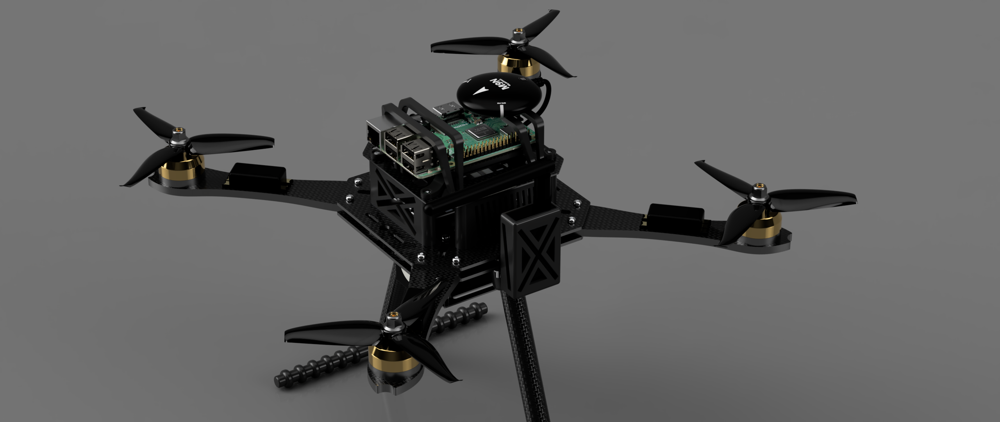

# AUTONOMUS_DRONE_PX4_SELF_DESIGN
Autonomous drone system developed as a Final Degree Project, integrating PX4 autopilot, and Gazebo for simulation, control, and autonomous mission execution.
=======
# AUTONOMOUS DRONE PX4 SELF DESIGN

**Trabajo Fin de Grado**

<table>
<tr><td><b>Autor</b></td><td>Antonio Montero Díaz</td></tr>
<tr><td><b>Titulación</b></td><td>Grado en Ingeniería Electrónica, Robótica y Mecatrónica</td></tr>
<tr><td><b>Mención</b></td><td>Control</td></tr>
<tr><td><b>Universidad</b></td><td>Universidad de Málaga</td></tr>
<tr><td><b>Curso Académico</b></td><td>2025-2026</td></tr>
<tr><td><b>Tutor</b></td><td>Ricardo Vázquez</td></tr>
</table>

---

This project implements an autonomous drone control system using the PX4 Autopilot flight stack and MAVSDK Python SDK. It demonstrates programmatic drone control including takeoff, landing, and offboard velocity-based flight maneuvers.



## Table of Contents

- [Project Overview](#project-overview)
- [System Architecture](#system-architecture)
- [Prerequisites](#prerequisites)
- [Installation](#installation)
- [Project Structure](#project-structure)
- [Usage](#usage)
- [Flight Scripts](#flight-scripts)
- [References](#references)

## Project Overview

This project explores autonomous drone navigation through software-in-the-loop (SITL) simulation. The system integrates:

- **PX4 Autopilot**: Open-source flight control software providing low-level flight control, state estimation, and safety features
- **MAVSDK**: High-level Python SDK for drone communication via MAVLink protocol
- **QGroundControl**: Ground control station for real-time monitoring and configuration

The implemented flight scripts demonstrate:
- Autonomous takeoff and landing sequences
- Offboard control mode with velocity-based navigation
- Real-time telemetry monitoring (altitude, flight mode, position)
- Asynchronous task management for concurrent operations

## System Architecture

```
┌─────────────────────────────────────────────────────────────────┐
│                    Ground Control Station                       │
│                      (QGroundControl)                           │
└─────────────────────────────────────────────────────────────────┘
                              │ MAVLink
                              ▼
┌─────────────────────────────────────────────────────────────────┐
│                      PX4 Autopilot (SITL)                       │
│  ┌─────────────┐  ┌─────────────┐  ┌─────────────────────────┐  │
│  │  Commander  │  │    EKF2     │  │  Position Controller    │  │
│  │  (State)    │  │ (Estimator) │  │  (mc_pos_control)       │  │
│  └─────────────┘  └─────────────┘  └─────────────────────────┘  │
│                         uORB Messaging                          │
└─────────────────────────────────────────────────────────────────┘
                              │ MAVLink (UDP:14540)
                              ▼
┌─────────────────────────────────────────────────────────────────┐
│                   MAVSDK Python Application                     │
│  ┌─────────────┐  ┌─────────────┐  ┌─────────────────────────┐  │
│  │   Action    │  │  Telemetry  │  │       Offboard          │  │
│  │ (arm/land)  │  │ (position)  │  │  (velocity control)     │  │
│  └─────────────┘  └─────────────┘  └─────────────────────────┘  │
└─────────────────────────────────────────────────────────────────┘
```

### Communication Protocols

| Interface | Protocol | Port | Purpose |
|-----------|----------|------|---------|
| MAVSDK ↔ PX4 | MAVLink over UDP | 14540 | Flight commands and telemetry |
| QGC ↔ PX4 | MAVLink over UDP | 14550 | Ground station monitoring |
| PX4 Internal | uORB | N/A | Inter-module publish-subscribe |

## Prerequisites

### System Requirements

- **Operating System**: Ubuntu 20.04 / 22.04 LTS (or WSL2 on Windows)
- **Python**: 3.8 or higher
- **RAM**: 8 GB minimum (16 GB recommended for Gazebo simulation)
- **Disk Space**: ~5 GB for PX4 and dependencies

### Required Software

- Git
- Python 3 with pip
- Build tools (gcc, g++, make, cmake)

## Installation

### 1. Clone this Repository

```bash
git clone https://github.com/YOUR_USERNAME/AutonomusDrone.git
cd AutonomusDrone
```

### 2. Initialize PX4-Autopilot Submodule

The PX4 flight stack is included as a git submodule. After cloning this repository, initialize and update the submodule:

```bash
cd AutonomusDrone
git submodule update --init --recursive
```

**About submodules:** PX4-Autopilot is tracked at a specific commit, ensuring reproducibility. To update PX4 to the latest version:

```bash
cd PX4-Autopilot
git pull origin main
cd ..
git add PX4-Autopilot
git commit -m "Update PX4-Autopilot submodule"
```

### 3. Install PX4 Dependencies

```bash
cd PX4-Autopilot
bash ./Tools/setup/ubuntu.sh
```

This script installs all necessary dependencies including:
- ARM GCC toolchain
- Gazebo Classic simulator
- Required Python packages

### 4. Set Up Python Virtual Environment

```bash
cd ..  # Return to AutonomusDrone directory
python3 -m venv mavsdk-env
source mavsdk-env/bin/activate
pip install mavsdk
```

### 5. Build PX4 SITL

```bash
cd PX4-Autopilot
make px4_sitl_default
```

## Project Structure

```
AutonomusDrone/
├── README.md                 # This file
├── CLAUDE.md                 # Development guidelines
├── .gitignore                # Git ignore rules
├── .gitmodules               # Git submodule configuration
│
├── PX4-Autopilot/            # PX4 flight stack (git submodule)
│   ├── src/modules/          # Flight control modules
│   ├── src/drivers/          # Hardware drivers
│   ├── ROMFS/                # Runtime filesystem
│   └── Tools/                # Build and setup tools
│
├── mavsdk_commands/          # Python flight control scripts
│   ├── vuelo_basico.py       # Basic takeoff/landing demo
│   └── vuelo_01.py           # Offboard velocity control demo
│
├── mavsdk-env/               # Python virtual environment
│
└── QGroundControl-x86_64.AppImage  # Ground control station
```

## Usage

### Starting the Simulation Environment

**Terminal 1 - Start PX4 SITL with Gazebo:**

```bash
cd PX4-Autopilot
make px4_sitl gazebo-classic
```

Wait until you see `INFO  [commander] Ready for takeoff!` in the console.

**Terminal 2 - Run Flight Script:**

```bash
cd AutonomusDrone
source mavsdk-env/bin/activate
python mavsdk_commands/vuelo_basico.py
```

**Optional - Ground Control Station:**

```bash
./QGroundControl-x86_64.AppImage
```

### Simulation Without Graphics

For faster testing without the Gazebo GUI:

```bash
HEADLESS=1 make px4_sitl gazebo-classic
```

## Flight Scripts

### vuelo_basico.py - Basic Flight Demo

Demonstrates fundamental autonomous flight operations:

1. Connects to PX4 SITL via UDP
2. Waits for GPS lock and home position
3. Arms the vehicle
4. Takes off to 10 meters altitude
5. Hovers for 10 seconds
6. Lands autonomously

**Features:**
- Concurrent telemetry monitoring (altitude, flight mode)
- Graceful task termination on landing
- Connection state verification

### vuelo_01.py - Offboard Velocity Control

Demonstrates offboard mode with velocity setpoints:

1. Connects and arms the vehicle
2. Enters offboard control mode
3. Executes a square pattern using NED velocity commands:
   - Forward (North) for 5 seconds
   - Left (East) for 5 seconds
   - Backward (South) for 5 seconds
   - Right (West) for 5 seconds
4. Stops and lands

**Key Concepts:**
- `VelocityNedYaw`: Velocity setpoint in North-East-Down frame
- Offboard mode requires continuous setpoint streaming
- Initial setpoint must be sent before starting offboard mode

## Development

### PX4 Build Commands

```bash
# SITL simulation build
make px4_sitl_default

# Build with Gazebo
make px4_sitl gazebo-classic

# Clean build artifacts
make clean

# Run unit tests
make tests

# Code style check
make check_format
```

### Creating New Flight Scripts

```python
import asyncio
from mavsdk import System

async def run():
    drone = System()
    await drone.connect(system_address="udp://:14540")

    # Wait for connection
    async for state in drone.core.connection_state():
        if state.is_connected:
            break

    # Your flight logic here
    await drone.action.arm()
    await drone.action.takeoff()
    # ...

if __name__ == "__main__":
    asyncio.run(run())
```

## References

### Documentation

- [PX4 User Guide](https://docs.px4.io/main/en/)
- [PX4 Developer Guide](https://docs.px4.io/main/en/development/development.html)
- [MAVSDK Python Documentation](https://mavsdk.mavlink.io/main/en/python/)
- [MAVLink Protocol](https://mavlink.io/en/)

### Related Projects

- [PX4-Autopilot](https://github.com/PX4/PX4-Autopilot) - Flight control stack
- [MAVSDK](https://github.com/mavlink/MAVSDK) - MAVLink SDK
- [QGroundControl](http://qgroundcontrol.com/) - Ground control station

---

## Licencia / License

Este proyecto ha sido desarrollado como Trabajo Fin de Grado en la Universidad de Málaga.

This project was developed as a Final Degree Project (TFG) at the University of Málaga, demonstrating autonomous drone control systems using open-source flight control software.

---

**Universidad de Málaga** | Escuela Técnica Superior de Ingenierías Industriales | 2025-2026

*Antonio Montero Díaz*
